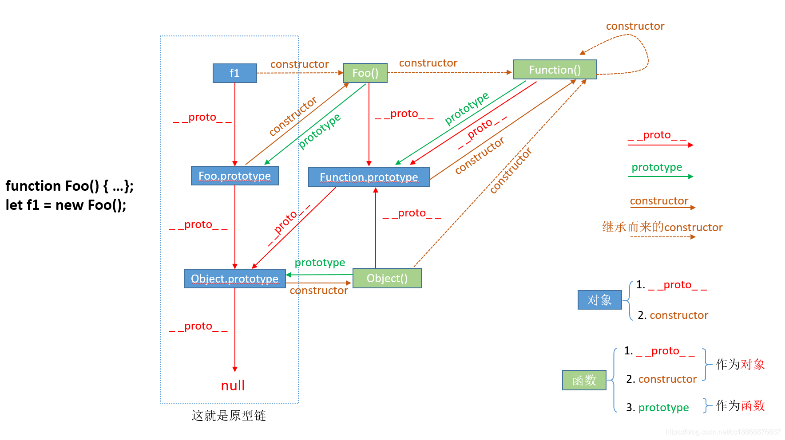

#### 1. [判断数组的4种方法](https://www.cnblogs.com/guanqiweb/p/10625539.html)

> instance, constructor, Array.isArray, Object.prototype.toString().call().slice(8, -1)

#### 2. JS继承

* [原型链继承](https://www.cnblogs.com/sarahwang/p/6870072.html)

    ```
    Child.prototype = new Parent()
    ````


    > 缺点： 引用类型的属性值会受到实例的影响而修改 

* [借用构造函数继承](https://www.cnblogs.com/sarahwang/p/6879161.html)

    ```
        function Child() {
            Parent.call(this);
        }
    ```
    > 缺点：1. 每个实例都拷贝一份，占用内存大，尤其是方法过多的时候。（函数复用又无从谈起了，本来我们用 prototype 就是解决复用问题的）
    > 2. 方法都作为了实例自己的方法，当需求改变，要改动其中的一个方法时，之前所有的实例，他们的该方法都不能及时作出更新。只有后面的实例才能访问到新方法。

* [组合继承](https://www.cnblogs.com/sarahwang/p/9098044.html)

    ```
    function Child() {
        Parent.call(this);
    }

    Child.prototype = new Parent();
    Child.prototype.constuctor = Child;
    ```


#### 3. [typeof](https://developer.mozilla.org/zh-CN/docs/Web/JavaScript/Reference/Operators/typeof)

1. typeof 返回 undefined, number, string, boolean, function, object, symbol(+), bigint(+)

2. typeof 无法区分 *null, array, object, 正则*

#### 4. [理解 JavaScript 的 async/await](https://segmentfault.com/a/1190000007535316)

1. async返回的是promise对象
2. await表达式自右向左运算，如果等到的不是promise，则同步任务，如果是，则进入微任务then

#### 5. [prototype & __proto__ & constructor](https://blog.csdn.net/cc18868876837/article/details/81211729)

__proto__   对象 -> 原型对象
prototype   函数 -> 原型对象
constructor 原型对象 -> 构造函数




#### 6. 函数柯里化

#### 7. 


